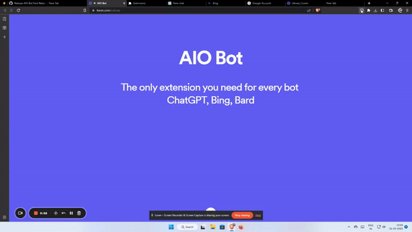
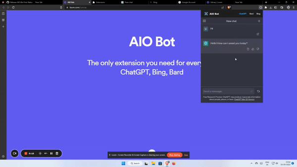

    

<h1 align="center">AIO Bot</h1>

Access your favourite AI bot on any website, completely for free.

[Preview](#Preview) | [Donation](https://www.buymeacoffee.com/umpixel) | [Credit](#Credit)

## ⚒️ Installation

The extension is designed to open the **OpenAI chat login page,** the **Bing sign-in page,** and the **Google accounts page.** And after authentication you can use it from anywhere just click on the extension and in the popup you can choose your favourite **AI Bot**.

**To install the extension, follow these steps:**

- [Download the zip file](https://github.com/madhurgoyal19/aio-bot/releases/tag/V1.0.0) and extract it.
- Open Google Chrome and navigate to chrome://extensions.
- Enable developer mode by toggling the switch in the top right corner.
- Click on "Load unpacked" and select the folder containing the extension's files.
- The extension should now be installed and the three tabs should open automatically.

## ✨ Features

- ChatGPT accessible on any website, no need to open a new tab every time you need help from ChatGPT.  
- Bard is also available in the extension and can be used from everywhere, just login once.
- ChatGPT with Browsing available using Bing GPT on every Browser.

## 🖱️ Usage

To use the extension, simply click on the extension icon in the Chrome toolbar. The popup window will appear and the three frames will generate automatically and you can choose which AI provider to use.

## Preview

**Integration with OpenAI's ChatGPT**

**Integration with Google's Bard**

**Integration with Bing's Chat**

## Credit

Thanks to [Bing Chat for all Browsers](https://github.com/anaclumos/bing-chat-for-all-browsers) and [Framer](https://github.com/MartinWie/Framer) for solutions relevant to my project. Their code was helpful in helping me overcome issues related to Bing Chat availability and iframes.

